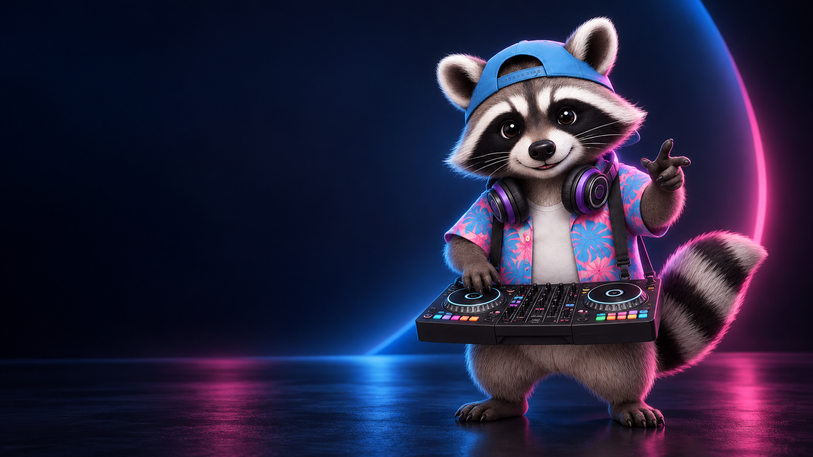
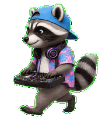

# Codex Pet Collective

An open collection of expressive, installable pets for Codex—made by people who care about a little more personality in the tools they use. DJ Bandit is our launch pet; Kira is the first addition to a roster designed to grow.

## Launch pet: DJ Bandit

DJ Bandit is a record-scratching raccoon with a sky-blue cap, a pink-and-blue vacation shirt, and a signature backwards moonwalk. He remains the featured launch pet in the Collective.

| Pet | Creator | License | Download |
| --- | --- | --- | --- |
| DJ Bandit | [Omar Tavarez](https://www.designedbyomar.com/) | CC BY 4.0 | [`pets/dj-bandit`](pets/dj-bandit/) |
| Kira | [Omar Tavarez](https://www.designedbyomar.com/) | CC BY 4.0 | [`pets/kira`](pets/kira/) |

## Install a pet

1. Download or clone this repository.
2. Copy a pet folder—for example [`pets/dj-bandit`](pets/dj-bandit/)—to `~/.codex/pets/`.
3. Open Codex settings and select the pet.

Each pet folder contains its `pet.json` manifest and `spritesheet.webp`. The manifest uses Codex’s v2 pet format.

## Add your own pet

The Collective is built to grow. Read [CONTRIBUTING.md](CONTRIBUTING.md), duplicate [`pets/TEMPLATE`](pets/TEMPLATE/), add your pet and one entry to [`pets/catalog.json`](pets/catalog.json), then open a pull request. The Pages site validates that catalog and renders new roster cards automatically. Every accepted pet stays credited to its creator.

## Project site

The project site is published with GitHub Pages from [`site/`](site/). The deployment workflow validates the catalog, copies release previews, and builds the browser-ready roster before deploying—so every approved pet preview appears on the homepage without a manual image edit.

## Credits

Created and curated by [Omar Tavarez](https://www.designedbyomar.com/) · **Designed by Omar**

The project and its launch pet are licensed under [CC BY 4.0](LICENSE). Contributors retain credit for their own work and agree to publish their submitted assets under the same license.
